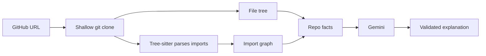

# RepoLens

**Paste any public GitHub repo and understand it in minutes.**

RepoLens clones a repository, analyzes its code with real parsers, and then explains it the way a senior developer would: what it does, how it is organised, which files to read first, and which concepts to learn before diving in.


## Why it exists

GitHub already shows you a file tree. What it does not show is *how the code fits together* or *where a newcomer should start*. RepoLens is built for students and developers who open an unfamiliar repo and don't know what to read first.

The key idea: **the analysis is done by code, and the AI only explains the results.** The model never sees the whole repo and is never trusted to invent file names.

## Features

- **File tree**: clean, collapsible view of the repo (ignores `node_modules`, `.git`, build folders).
- **Import graph**: JavaScript and TypeScript files are parsed with Tree-sitter, and every `import`, `export ... from`, `require()` and dynamic `import()` is resolved to the real file it points to.
  - **Core files view** (default): the 20 most connected files, with tests and benchmarks filtered out, so the graph is actually readable.
  - **All files view**: the full graph.
  - **Click any file** to highlight what it imports and what imports it.
  - Files are colour-coded by folder, and arrows show direction.
- **AI explanation**: a plain-English summary, how the code is organised, an ordered "start reading here" list, and the concepts you should know first.
- **Works on non-JS repos too**: the explanation uses the README, languages, folders and file list (the import graph is JS/TS only for now).


## How it works



1. The URL is validated with a strict pattern, then the repo is cloned (`--depth 1`) into a temp folder that is deleted after the request.
2. The file tree is built, skipping ignored folders and symlinks.
3. JS/TS files are parsed with **Tree-sitter (WASM)**. Import specifiers are resolved to repo files, including `@/` aliases, `index` files and `.js` imports that point at `.ts` sources.
4. A small **facts** summary is collected locally: README excerpt, `package.json` description and dependencies, languages, top folders, entry files and the most imported files.
5. Only those facts are sent to the LLM, which returns structured JSON.
6. The answer is parsed and validated before it reaches the UI.

## Design decisions

- **AI explains, code analyzes.** Graph building, import resolution and fact collection are deterministic and local. The LLM gets a few kilobytes of facts, not the codebase.
- **No made-up files.** Any file the AI recommends must exist in the facts it was given. Anything else is dropped before display.
- **Cheap to run.** Explanations are cached on disk, keyed by the repo facts, the model and the prompt version, so analyzing the same repo again costs no API call.
- **Resilient to busy APIs.** If Gemini returns a temporary error (500/502/503/504), requests are retried once and then fall back to a lighter model.
- **Swappable AI provider.** The LLM sits behind a small `LlmProvider` interface (`lib/llm/`). Adding Groq or Ollama means adding one file and one `case`.
- **WASM Tree-sitter instead of native.** `web-tree-sitter` needs no C++ build tools, so it installs cleanly on Windows, macOS and Linux.
- **Safe by default.** Only `github.com/owner/repo` URLs are accepted, symlinks are skipped, large files are ignored, and API keys stay in `.env.local` on the server.

## Tech stack

| Area | Tools |
| --- | --- |
| Framework | Next.js (App Router), React, TypeScript |
| Styling | Tailwind CSS |
| Code analysis | web-tree-sitter, tree-sitter-wasms |
| Graph UI | React Flow |
| Git | simple-git |
| AI | Google Gemini API (free tier works) |

## Getting started

### Prerequisites

- Node.js 20 or newer
- Git installed and available in your terminal
- A free Gemini API key from [aistudio.google.com/apikey](https://aistudio.google.com/apikey)

### Install and run

```bash
git clone https://github.com/jashan2128/repolens.git
cd repolens
npm install
```

Create a file named `.env.local` in the project root:

```env
GEMINI_API_KEY=your_key_here
```

Start the app:

```bash
npm run dev
```

Open [http://localhost:3000](http://localhost:3000), paste a repo URL such as `github.com/sindresorhus/ky`, and click **Explain this repo**.

The key is read when the server starts, so restart `npm run dev` after changing `.env.local`.

### Environment variables

| Variable | Default | Purpose |
| --- | --- | --- |
| `GEMINI_API_KEY` | none (required) | Your Gemini API key |
| `GEMINI_MODEL` | `gemini-flash-latest` | Main model |
| `GEMINI_FALLBACK_MODEL` | `gemini-flash-lite-latest` | Used when the main model is busy |
| `LLM_PROVIDER` | `gemini` | Set to `mock` to test the UI without any API calls |

Model names change over time. If you see "model not found", list the models your key can use at [aistudio.google.com](https://aistudio.google.com) and set `GEMINI_MODEL`.

## Project structure

```
src/
├── app/
│   ├── page.tsx                  # main page
│   └── api/
│       ├── analyze/route.ts      # clone, tree, graph, facts
│       └── explain/route.ts      # facts -> AI explanation
├── components/                   # RepoForm, FileTree, ImportGraph, ExplainPanel, ...
├── hooks/                        # useAnalyze, useExplain
└── lib/
    ├── cloneRepo.ts, buildFileTree.ts, parseGithubUrl.ts
    ├── treeSitter.ts, parseImports.ts, resolveImport.ts, buildGraph.ts
    ├── selectCore.ts, layoutGraph.ts, toFlow.tsx, graphColors.ts
    ├── collectFacts.ts, buildPrompt.ts, parseExplanation.ts, explainRepo.ts
    ├── cache.ts, isRepoFacts.ts
    └── llm/                      # provider interface, Gemini, mock, retry
```

Each file does one job, so problems are easy to trace.

## Limitations

- Public repositories only.
- The import graph supports JavaScript and TypeScript only. Other languages still get a file tree and an explanation.
- Repos are shallow-cloned (latest commit only), and very large repos are capped at 3,000 files in the tree and 400 source files in the graph.
- Explanations come from an AI model and can be wrong, so treat them as a guide, not a source of truth.
- Free Gemini limits apply and may change.

## Roadmap

- [ ] Commit timeline: how the project evolved, with milestones and an activity chart
- [ ] `#include` graph for C and C++ repos
- [ ] Python import graph
- [ ] Private repos with a GitHub token
- [ ] Hosted demo

## Author

Built by [Jashan](https://github.com/jashan2128).
